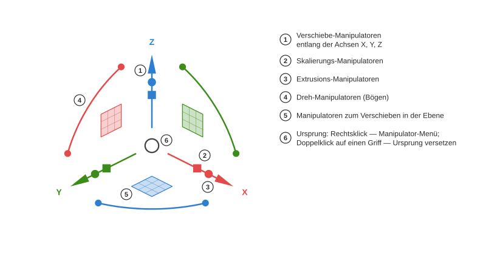

# Axel

*[English](README.md) · [Русский](README.ru.md) · Deutsch · [Français](README.fr.md) · [Español](README.es.md) · [Português (Brasil)](README.pt-BR.md) · [简体中文](README.zh-CN.md) · [日本語](README.ja.md)*

Objekt-Manipulator für die 3D-Ansicht von FreeCAD nach dem Vorbild des Gumball aus Rhinoceros. Python-Paket `freecad.axel`.

## Verwendung

### Griffe

Wählen Sie ein Objekt aus, und der Manipulator erscheint in der Mitte seines Begrenzungsrahmens. **Pfeile** verschieben entlang einer Achse, das **Quadrat** verschiebt in einer Ebene, **Bögen** drehen; eine gestrichelte Hilfslinie und eine Beschriftung neben dem Cursor zeigen den aktuellen Abstand oder Winkel. Der kleine **Würfel** auf einem Pfeil skaliert entlang dieser Achse; der **Punkt** extrudiert — hier wird eine geschlossene Draft-Linie mit Fläche zu einem `Part::Extrusion`-Körper. Würfel und Punkte erscheinen an Objekten, deren Arbeitsbereich einen Adapter mit diesen Fähigkeiten angemeldet hat (Draft-Linien und -Eckpunkte, das Beispiel `examples/cylinder.py`). **Umschalt** verfeinert: gleichmäßige Skalierung am Würfel, Skalierung in der Ebene am Quadrat, Extrusion nach beiden Seiten am Punkt. Jedes Ziehen ist ein Rückgängig-Schritt.

### Draft-Linien: Eckpunkte und Extrusion

Eine ausgewählte Draft-Linie zeigt **Marker** an ihren Eckpunkten. Klicken Sie auf einen Marker, und der Manipulator springt zu diesem Eckpunkt: Die Pfeile bewegen jetzt nur noch diesen Punkt. Am Endpunkt einer offenen Linie zieht der Extrusionspunkt ein **neues Segment** heraus — erneut ziehen, um die Linie fortzusetzen. Ein Klick auf die Linie selbst bringt den Manipulator zum ganzen Objekt zurück; der Skalierungswürfel transformiert dann alle Punkte exakt und lässt das `Placement` unangetastet.

### Manipulator-Menü

**Rechtsklick auf den Ursprung** öffnet das Menü: Rahmen versetzen oder zurücksetzen (ein **Doppelklick** auf einen beliebigen Griff startet das Versetzen des Ursprungs ebenfalls), **Ausrichtung** wählen, eine **Operation** vormerken, die **Zugstärke** einstellen, Gruppen von **Griffen** aus- oder einblenden. Der Umschalter **Schritt** rastet Verschiebungen, Drehungen und Skalierungen auf die eingestellten Schrittweiten ein — die Beschriftung lautet dann „10,00 mm · Schritt“; **Strg** während des Ziehens kehrt den Umschalter vorübergehend um.

### Ausrichtung

Der Rahmen kann den **Welt**-Achsen folgen, den eigenen Achsen des **Objekts** (`Placement` oder ein Hinweis des Adapters — bei einer Draft-Linie läuft X entlang ihres ersten Segments), der **Arbeitsebene** von Draft oder der **Ansicht** (X und Y in der Bildschirmebene). Dieselben Griffe, andere Richtungen; der Modus wird in den Einstellungen gespeichert und lässt sich auch mit dem Befehl *Axel: nächste Ausrichtung* durchschalten.

### Doppelte Buchstaben: Kopieren, Teilen, Extrudieren

Drücken Sie einen Buchstaben zweimal **vor** dem Ziehen, um eine Operation für das nächste Ziehen vorzumerken; der Hinweis erscheint neben dem Cursor. `C, C` — das Ziehen erzeugt eine **Kopie** und wählt sie aus, eine Serie ist also einfach wieder `C, C`. `D, D` auf einer Draft-Linie macht aus dem Ziehen einen **Schieberegler** für die Anzahl der Segmente (Marker zeigen die künftigen Eckpunkte an; eine Ziffer setzt die genaue Anzahl). `E, E` bei ausgewähltem Endpunkt **extrudiert** daraus ein neues Segment. Adapter von Arbeitsbereichen können eigene Buchstaben anmelden.

### Numerische Eingabe

**Klicken** Sie auf einen Pfeil, Bogen oder Skalierungswürfel, statt ihn zu ziehen, und ein Eingabefeld erscheint: `25` ⏎ verschiebt um 25 mm, `45` ⏎ dreht um 45°, `1,5` ⏎ skaliert um das 1,5-Fache. **Während des Ziehens** einfach lostippen: Die Ziffer öffnet das Feld entlang der aktuellen Richtung, und das Feld versteht Einheiten und Ausdrücke — `3 cm` ergibt genau 30 mm.

Für Autoren von Arbeitsbereichen: [docs/Adapter Author Guide.md](docs/Adapter%20Author%20Guide.md) (englisch); die API ist `freecad.axel.api` (`API_VERSION = 1`).

## Voraussetzungen

- FreeCAD ≥ 1.1 (Python 3.11, pivy und PySide wie mit FreeCAD ausgeliefert). Keine externen Abhängigkeiten.

## Installation

**Addon-Manager** (Werkzeuge → Addon-Manager, Inhaltstyp „Sonstige“). Solange Axel nicht im FreeCAD-Katalog steht, fügen Sie das Repository von Hand hinzu: In den Einstellungen des Addon-Managers („Benutzerdefiniertes Projektarchiv“) `https://github.com/Onyx125/Axel` mit dem Zweig `main` eintragen, dann „Axel“ in der Liste suchen und auf „Installieren“ klicken. Axel ist kein Arbeitsbereich, deshalb **erinnert der Addon-Manager nicht an den Neustart**: Starten Sie FreeCAD nach dem Installieren oder Aktualisieren von Hand neu.

**Von Hand:** Kopieren Sie den Repository-Ordner (oder entpacken Sie ein Release-Archiv) nach `Mod/Axel` im FreeCAD-Benutzerordner — unter Windows `%APPDATA%\FreeCAD\v1-1\Mod\Axel` —, sodass `package.xml` und `freecad/axel/` darin liegen. Starten Sie FreeCAD neu.

Nach dem Start erscheint der Manipulator am ausgewählten Objekt; die Schaltfläche „Axel“ in der Statusleiste oder der Befehl im Menü „Ansicht“ schaltet ihn ein und aus.

## Lizenz

LGPL-2.1-or-later, dieselbe wie bei FreeCAD.
