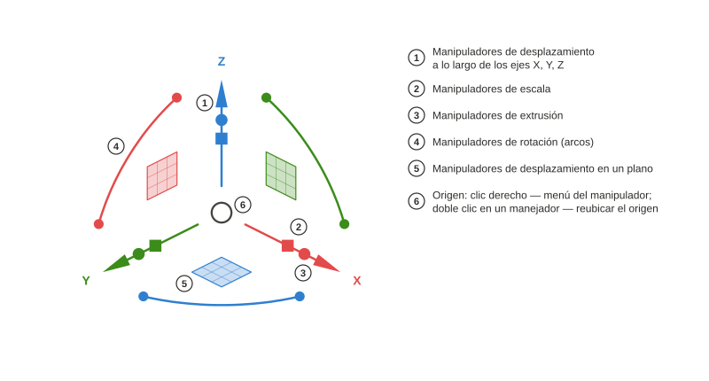

# Axel

*[English](README.md) · [Русский](README.ru.md) · [Deutsch](README.de.md) · [Français](README.fr.md) · Español · [Português (Brasil)](README.pt-BR.md) · [简体中文](README.zh-CN.md) · [日本語](README.ja.md)*

Manipulador de objetos para la vista 3D de FreeCAD, inspirado en el Gumball de Rhinoceros. Paquete de Python `freecad.axel`.

## Uso

### Manejadores

Seleccione un objeto y el manipulador aparece en el centro de su caja envolvente. Las **flechas** mueven a lo largo de un eje, el **cuadrado** mueve en un plano, los **arcos** rotan; una guía discontinua y una etiqueta junto al cursor muestran la distancia o el ángulo actual. El pequeño **cubo** de una flecha escala a lo largo de ese eje; el **punto** extruye — aquí una línea Draft cerrada con cara se convierte en un sólido `Part::Extrusion`. Cubos y puntos aparecen en los objetos cuyo banco de trabajo ha declarado un adaptador con esas capacidades (líneas y vértices de Draft, el ejemplo `examples/cylinder.py`). **Mayús** afina: escala uniforme en un cubo, escala en el plano en el cuadrado, extrusión hacia ambos lados en un punto. Cada arrastre es un paso de deshacer.

### Líneas Draft: vértices y extrusión

Una línea Draft seleccionada muestra **marcadores** en sus vértices. Haga clic en un marcador y el manipulador salta a ese vértice: las flechas ahora mueven solo ese punto. En el vértice final de una línea abierta, el punto de extrusión saca un **nuevo segmento** — arrástrelo de nuevo para continuar la línea. Un clic en la propia línea devuelve el manipulador al objeto completo; el cubo de escala entonces transforma todos los puntos con precisión, sin tocar el `Placement`.

### Menú del manipulador

**Clic derecho en el origen** para el menú: reubicar o restablecer el marco (un **doble clic** en cualquier manejador también inicia la reubicación del origen), elegir la **alineación**, armar una **operación**, ajustar la **fuerza de arrastre**, ocultar o mostrar grupos de **manejadores**. El conmutador **Paso** ajusta movimientos, rotaciones y escalas a los incrementos configurados — la etiqueta muestra entonces «10,00 mm · paso»; **Ctrl** durante un arrastre invierte el conmutador temporalmente.

### Alineación

El marco puede seguir los ejes del **mundo**, los ejes propios del **objeto** (`Placement`, o una indicación del adaptador — en una línea Draft, X sigue su primer segmento), el **plano de trabajo** de Draft o la **vista** (X e Y en el plano de la pantalla). Los mismos manejadores, direcciones distintas; el modo se recuerda en las preferencias y también puede recorrerse con el comando *Axel: siguiente alineación*.

### Letras dobles: copiar, dividir, extruir

Pulse una letra dos veces **antes** de arrastrar para armar una operación para el siguiente arrastre; la indicación aparece junto al cursor. `C, C` — el arrastre crea una **copia** y la selecciona, así que una serie es simplemente `C, C` otra vez. `D, D` en una línea Draft convierte el arrastre en un **deslizador** del número de segmentos (los marcadores previsualizan los nuevos vértices; un dígito fija el número exacto). `E, E` con un vértice final seleccionado **extruye** un nuevo segmento desde él. Los adaptadores de bancos de trabajo pueden declarar sus propias letras.

### Entrada numérica

**Haga clic** en una flecha, un arco o un cubo de escala en lugar de arrastrarlo y aparece un campo de entrada: `25` ⏎ mueve 25 mm, `45` ⏎ rota 45°, `1,5` ⏎ escala ×1,5. **Durante un arrastre** simplemente empiece a teclear: el dígito abre el campo en la dirección actual, y el campo entiende unidades y expresiones — `3 cm` da exactamente 30 mm.

Autores de bancos de trabajo: [docs/Adapter Author Guide.md](docs/Adapter%20Author%20Guide.md) (en inglés); la API es `freecad.axel.api` (`API_VERSION = 1`).

## Requisitos

- FreeCAD ≥ 1.1 (Python 3.11, pivy y PySide tal como se distribuyen con FreeCAD). Sin dependencias externas.

## Instalación

**Administrador de complementos** (Herramientas → *Addon Manager* — en FreeCAD 1.1 la entrada del menú sigue en inglés —, tipo de contenido «Otros»). Hasta que Axel figure en el catálogo de FreeCAD, añada el repositorio a mano: en las preferencias del Administrador de complementos («Repositorios personalizados») introduzca `https://github.com/Onyx125/Axel` con la rama `main`, luego busque «Axel» en la lista y pulse Instalar. Axel no es un banco de trabajo, así que el Administrador de complementos **no le recordará reiniciar**: reinicie FreeCAD a mano después de instalar o actualizar.

**A mano:** copie la carpeta del repositorio (o descomprima un archivo de versión) en `Mod/Axel` de su carpeta de usuario de FreeCAD — en Windows `%APPDATA%\FreeCAD\v1-1\Mod\Axel` — de modo que `package.xml` y `freecad/axel/` queden dentro. Reinicie FreeCAD.

Tras el arranque, el manipulador aparece en el objeto seleccionado; el botón «Axel» de la barra de estado o el comando del menú Ver lo activan y desactivan.

## Licencia

LGPL-2.1-or-later, la misma que FreeCAD.
