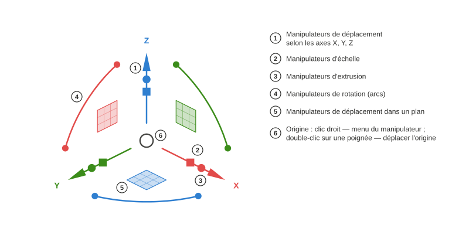

# Axel

*[English](README.md) · [Русский](README.ru.md) · [Deutsch](README.de.md) · Français · [Español](README.es.md) · [Português (Brasil)](README.pt-BR.md) · [简体中文](README.zh-CN.md) · [日本語](README.ja.md)*

Manipulateur d'objets pour la vue 3D de FreeCAD, inspiré du Gumball de Rhinoceros. Paquet Python `freecad.axel`.

## Utilisation

### Poignées

Sélectionnez un objet : le manipulateur apparaît au centre de sa boîte englobante. Les **flèches** déplacent le long d'un axe, le **carré** déplace dans un plan, les **arcs** font tourner ; un guide en pointillés et une étiquette près du curseur indiquent la distance ou l'angle courant. Le petit **cube** sur une flèche met à l'échelle le long de cet axe ; le **point** extrude — ici une ligne Draft fermée avec face devient un solide `Part::Extrusion`. Cubes et points apparaissent sur les objets dont l'atelier a déclaré un adaptateur doté de ces capacités (lignes et sommets Draft, l'exemple `examples/cylinder.py`). **Maj** affine : mise à l'échelle uniforme sur un cube, mise à l'échelle dans le plan sur le carré, extrusion des deux côtés sur un point. Chaque glissement est une étape d'annulation.

### Lignes Draft : sommets et extrusion

Une ligne Draft sélectionnée affiche des **marqueurs** sur ses sommets. Cliquez sur un marqueur et le manipulateur saute à ce sommet : les flèches ne déplacent plus que ce point. Sur le sommet d'extrémité d'une ligne ouverte, le point d'extrusion tire un **nouveau segment** — tirez de nouveau pour prolonger la ligne. Un clic sur la ligne elle-même ramène le manipulateur à l'objet entier ; le cube d'échelle transforme alors tous les points avec précision, sans toucher au `Placement`.

### Menu du manipulateur

**Clic droit sur l'origine** pour le menu : déplacer ou réinitialiser le repère (un **double-clic** sur n'importe quelle poignée lance aussi le déplacement de l'origine), choisir l'**alignement**, armer une **opération**, régler la **force de glissement**, masquer ou afficher des groupes de **poignées**. L'interrupteur **Pas** accroche déplacements, rotations et mises à l'échelle aux incréments configurés — l'étiquette affiche alors « 10,00 mm · pas » ; **Ctrl** pendant un glissement inverse temporairement l'interrupteur.

### Alignement

Le repère peut suivre les axes du **monde**, les axes propres de l'**objet** (`Placement`, ou une indication de l'adaptateur — pour une ligne Draft, X suit son premier segment), le **plan de travail** de Draft ou la **vue** (X et Y dans le plan de l'écran). Mêmes poignées, directions différentes ; le mode est mémorisé dans les préférences et peut aussi être parcouru avec la commande *Axel : alignement suivant*.

### Lettres doublées : copier, diviser, extruder

Appuyez deux fois sur une lettre **avant** de glisser pour armer une opération pour le prochain glissement ; l'indication apparaît près du curseur. `C, C` — le glissement crée une **copie** et la sélectionne, une série n'est donc que `C, C` à nouveau. `D, D` sur une ligne Draft transforme le glissement en **curseur** du nombre de segments (les marqueurs prévisualisent les nouveaux sommets ; un chiffre fixe le nombre exact). `E, E` avec un sommet d'extrémité sélectionné **extrude** un nouveau segment depuis celui-ci. Les adaptateurs d'ateliers peuvent déclarer leurs propres lettres.

### Saisie numérique

**Cliquez** sur une flèche, un arc ou un cube d'échelle au lieu de le glisser : un champ de saisie apparaît. `25` ⏎ déplace de 25 mm, `45` ⏎ tourne de 45°, `1,5` ⏎ met à l'échelle ×1,5. **Pendant un glissement**, commencez simplement à taper : le chiffre ouvre le champ selon la direction courante, et le champ comprend les unités et les expressions — `3 cm` donne exactement 30 mm.

Auteurs d'ateliers : [docs/Adapter Author Guide.md](docs/Adapter%20Author%20Guide.md) (en anglais) ; l'API est `freecad.axel.api` (`API_VERSION = 1`).

## Prérequis

- FreeCAD ≥ 1.1 (Python 3.11, pivy et PySide tels que livrés avec FreeCAD). Aucune dépendance externe.

## Installation

**Gestionnaire des extensions** (Outils → Gestionnaire des extensions, type de contenu « Autre chose »). Tant qu'Axel n'est pas répertorié dans le catalogue FreeCAD, ajoutez le dépôt à la main : dans les préférences du gestionnaire (« Dépôts personnalisés »), saisissez `https://github.com/Onyx125/Axel` avec la branche `main`, puis trouvez « Axel » dans la liste et cliquez sur Installer. Axel n'est pas un atelier, donc le gestionnaire **ne vous rappellera pas de redémarrer** : redémarrez FreeCAD à la main après l'installation ou la mise à jour.

**À la main :** copiez le dossier du dépôt (ou décompressez une archive de version) dans `Mod/Axel` de votre dossier utilisateur FreeCAD — sous Windows `%APPDATA%\FreeCAD\v1-1\Mod\Axel` — de sorte que `package.xml` et `freecad/axel/` s'y trouvent. Redémarrez FreeCAD.

Après le démarrage, le manipulateur apparaît sur l'objet sélectionné ; le bouton « Axel » de la barre d'état ou la commande du menu Affichage l'active et le désactive.

## Licence

LGPL-2.1-or-later, la même que FreeCAD.
