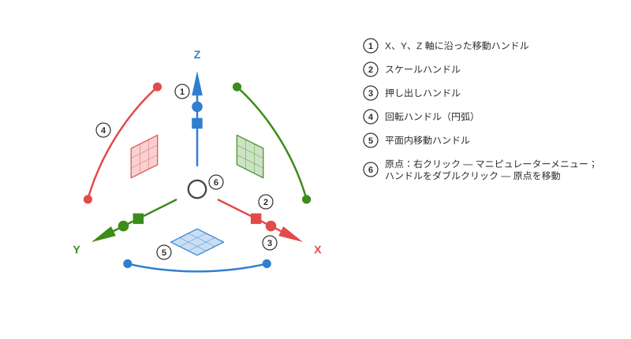

# Axel

*[English](README.md) · [Русский](README.ru.md) · [Deutsch](README.de.md) · [Français](README.fr.md) · [Español](README.es.md) · [Português (Brasil)](README.pt-BR.md) · [简体中文](README.zh-CN.md) · 日本語*

FreeCAD の 3D ビュー用オブジェクトマニピュレーター。Rhinoceros の Gumball を手本にしています。Python パッケージ `freecad.axel`。

## 使い方

### ハンドル

オブジェクトを選択すると、そのバウンディングボックスの中心にマニピュレーターが現れます。**矢印**は軸に沿って移動、**四角**は平面内で移動、**円弧**は回転します。破線のガイドとカーソル脇のラベルが現在の距離や角度を示します。矢印上の小さな**立方体**はその軸方向にスケール、**点**は押し出しを行います — ここでは面を持つ閉じた Draft 線が `Part::Extrusion` ソリッドになります。立方体と点は、ワークベンチがそれらの機能を持つアダプターを登録したオブジェクトにのみ表示されます（Draft の線と頂点、サンプル `examples/cylinder.py`）。**Shift** で細かく指定できます：立方体では均等スケール、四角では平面内スケール、点では両側への押し出し。各ドラッグは 1 回の取り消し単位です。

### Draft 線：頂点と押し出し

選択した Draft 線には頂点に**マーカー**が表示されます。マーカーをクリックするとマニピュレーターがその頂点に移り、矢印はその点だけを動かします。開いた線の端点では、押し出しの点が**新しいセグメント**を引き出します — もう一度ドラッグすると線が続きます。線そのものをクリックするとマニピュレーターはオブジェクト全体に戻り、スケールの立方体は `Placement` を変えずにすべての点を正確に変換します。

### マニピュレーターメニュー

**原点を右クリック**するとメニューが開きます：フレームの移動やリセット（任意のハンドルを**ダブルクリック**しても原点の移動が始まります）、**整列**の選択、**操作**の予約、**ドラッグの強さ**の設定、**ハンドル**グループの表示・非表示。**ステップ**の切り替えで、移動・回転・スケールが設定した刻みにスナップします — ラベルは「10.00 mm · ステップ」と表示されます。ドラッグ中の **Ctrl** で切り替えを一時的に反転できます。

### 整列

フレームは**ワールド**軸、**オブジェクト**自身の軸（`Placement`、またはアダプターからのヒント — Draft 線では X が最初のセグメントに沿います）、Draft の**作業平面**、あるいは**ビュー**（X と Y が画面平面内）に従わせることができます。ハンドルは同じで、方向だけが変わります。モードは設定に記憶され、*Axel: 次の整列* コマンドで順に切り替えることもできます。

### 二度押しの文字：コピー、分割、押し出し

ドラッグの**前**に同じ文字を二度押すと、次のドラッグに操作が予約され、ヒントがカーソル脇に表示されます。`C, C` — ドラッグで**コピー**を作成して選択するので、連続コピーはまた `C, C` を押すだけです。Draft 線で `D, D` を押すと、ドラッグがセグメント数の**スライダー**になります（マーカーが新しい頂点をプレビューし、数字で正確な数を指定できます）。端点を選択して `E, E` を押すと、そこから新しいセグメントを**押し出し**ます。ワークベンチのアダプターは独自の文字を登録できます。

### 数値入力

矢印・円弧・スケールの立方体をドラッグする代わりに**クリック**すると入力欄が現れます：`25` ⏎ で 25 mm 移動、`45` ⏎ で 45° 回転、`1.5` ⏎ で 1.5 倍にスケール。**ドラッグ中**はそのまま入力を始めるだけです。数字を押すと現在の方向に沿って入力欄が開き、単位や式も理解します — `3 cm` はちょうど 30 mm になります。

ワークベンチ作者向け：[docs/Adapter Author Guide.md](docs/Adapter%20Author%20Guide.md)（英語）。API は `freecad.axel.api`（`API_VERSION = 1`）です。

## 動作要件

- FreeCAD ≥ 1.1（Python 3.11、pivy、PySide は FreeCAD 同梱のもの）。外部依存はありません。

## インストール

**アドオン・マネージャー**（ツール → *Addon Manager* — FreeCAD 1.1 ではこのメニュー項目はまだ英語です — コンテンツの種類「Other」）。Axel が FreeCAD のカタログに掲載されるまでは、リポジトリを手動で追加してください：アドオン・マネージャーの設定（「カスタムリポジトリ」）に `https://github.com/Onyx125/Axel`、ブランチ `main` を入力し、一覧から「Axel」を見つけてインストールを押します。Axel はワークベンチではないため、アドオン・マネージャーは**再起動を促しません**。インストールや更新の後は FreeCAD を手動で再起動してください。

**手動：**リポジトリのフォルダー（またはリリースアーカイブを展開したもの）を FreeCAD ユーザーフォルダーの `Mod/Axel` にコピーします — Windows では `%APPDATA%\FreeCAD\v1-1\Mod\Axel` — その中に `package.xml` と `freecad/axel/` が入るようにします。FreeCAD を再起動します。

起動後、選択したオブジェクトにマニピュレーターが表示されます。ステータスバーの「Axel」ボタン、または「表示」メニューのコマンドでオン・オフを切り替えられます。

## ライセンス

LGPL-2.1-or-later（FreeCAD と同じ）。
