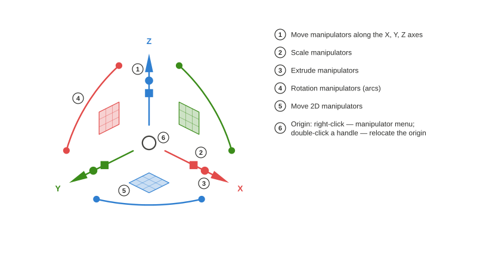

# Axel

*English · [Русский](README.ru.md)*

Object manipulator for the FreeCAD 3D view, modelled on the Gumball from Rhinoceros. Python package `freecad.axel`.

## Usage

Select an object and the manipulator appears on it. Arrows move along the axes, squares move in a plane, arcs rotate. Scale cubes and extrude dots appear on objects whose workbench has declared an adapter with those capabilities (for example, Draft vertices and lines, or the `examples/cylinder.py` sample).

- **Click** an arrow, arc or cube for numeric input; **typing digits while dragging** works too.
- **Ctrl** temporarily inverts snapping (the toggle itself is the *Axel: step* command in the View menu); **Shift** — uniform scale, scale in a plane, extrude to both sides.
- **Double letters before dragging:** `C, C` — copy, `E, E` — extrude (for a Draft line: a new segment from the end vertex), `D, D` — split into segments with a slider. Operations declared by workbench adapters get their own letters and commands automatically.
- **Double-click** a handle to relocate the origin; **right-click** the origin for the manipulator menu; **Esc** cancels a drag; otherwise it acts like a click on empty space — the selection is cleared and the manipulator goes away.
- An object that a workbench command selects right after creating it (Draft Line, for instance) is not picked up: the selection is cleared and the manipulator appears once you select the object yourself (the "Deselect new objects…" setting, on by default).
- Settings — Edit → Preferences → Axel; commands — the View menu.

Workbench authors: [docs/Adapter Author Guide.md](docs/Adapter%20Author%20Guide.md); the API is `freecad.axel.api` (`API_VERSION = 1`).

## Requirements

- FreeCAD ≥ 1.1 (Python 3.11, pivy and PySide as shipped with FreeCAD). No external dependencies.

## Installation

**Addon Manager** (Tools → Addon Manager, content type "other"). Until Axel is listed in the FreeCAD catalog, add the repository by hand: in the Addon Manager preferences ("Custom repositories") enter `https://github.com/Onyx125/Axel` with branch `main`, then find "Axel" in the list and press Install. Axel is not a workbench, so the Addon Manager **will not remind you to restart**: restart FreeCAD manually after installing or updating.

**Manually:** copy the repository folder (or unpack a release archive) into `Mod/Axel` of your FreeCAD user folder — on Windows `%APPDATA%\FreeCAD\v1-1\Mod\Axel` — so that `package.xml` and `freecad/axel/` are inside it. Restart FreeCAD.

After start-up the manipulator appears on the selected object; the "Axel" button in the status bar or the command in the View menu turns it on and off.

## Licence

LGPL-2.1-or-later, the same as FreeCAD.
