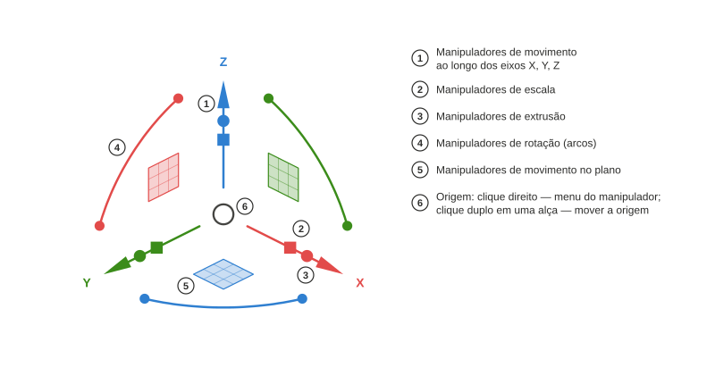

# Axel

*[English](README.md) · [Русский](README.ru.md) · [Deutsch](README.de.md) · [Français](README.fr.md) · [Español](README.es.md) · Português (Brasil) · [简体中文](README.zh-CN.md) · [日本語](README.ja.md)*

Manipulador de objetos para a vista 3D do FreeCAD, inspirado no Gumball do Rhinoceros. Pacote Python `freecad.axel`.

## Uso

### Alças

Selecione um objeto e o manipulador aparece no centro da sua caixa delimitadora. As **setas** movem ao longo de um eixo, o **quadrado** move em um plano, os **arcos** rotacionam; uma guia tracejada e um rótulo junto ao cursor mostram a distância ou o ângulo atual. O pequeno **cubo** em uma seta escala ao longo desse eixo; o **ponto** extruda — aqui uma linha Draft fechada com face vira um sólido `Part::Extrusion`. Cubos e pontos aparecem nos objetos cuja bancada declarou um adaptador com essas capacidades (linhas e vértices do Draft, o exemplo `examples/cylinder.py`). **Shift** refina: escala uniforme em um cubo, escala no plano no quadrado, extrusão para os dois lados em um ponto. Cada arrasto é um passo de desfazer.

### Linhas Draft: vértices e extrusão

Uma linha Draft selecionada mostra **marcadores** nos seus vértices. Clique em um marcador e o manipulador pula para esse vértice: as setas agora movem só esse ponto. No vértice final de uma linha aberta, o ponto de extrusão puxa um **novo segmento** — arraste de novo para continuar a linha. Um clique na própria linha devolve o manipulador ao objeto inteiro; o cubo de escala então transforma todos os pontos com precisão, sem mexer no `Placement`.

### Menu do manipulador

**Clique com o botão direito na origem** para o menu: mover ou redefinir o quadro (um **clique duplo** em qualquer alça também inicia a mudança da origem), escolher o **alinhamento**, armar uma **operação**, ajustar a **força do arrasto**, ocultar ou mostrar grupos de **alças**. A chave **Passo** ajusta movimentos, rotações e escalas aos incrementos configurados — o rótulo então mostra "10,00 mm · passo"; **Ctrl** durante um arrasto inverte a chave temporariamente.

### Alinhamento

O quadro pode seguir os eixos do **mundo**, os eixos próprios do **objeto** (`Placement`, ou uma dica do adaptador — em uma linha Draft, X segue o seu primeiro segmento), o **plano de trabalho** do Draft ou a **vista** (X e Y no plano da tela). As mesmas alças, direções diferentes; o modo fica guardado nas preferências e também pode ser alternado com o comando *Axel: próximo alinhamento*.

### Letras duplas: copiar, dividir, extrudar

Pressione uma letra duas vezes **antes** de arrastar para armar uma operação para o próximo arrasto; a dica aparece junto ao cursor. `C, C` — o arrasto cria uma **cópia** e a seleciona, então uma série é simplesmente `C, C` de novo. `D, D` em uma linha Draft transforma o arrasto em um **controle deslizante** do número de segmentos (os marcadores mostram os novos vértices; um dígito define o número exato). `E, E` com um vértice final selecionado **extruda** um novo segmento a partir dele. Adaptadores de bancadas podem declarar as suas próprias letras.

### Entrada numérica

**Clique** em uma seta, um arco ou um cubo de escala em vez de arrastá-lo e um campo de entrada aparece: `25` ⏎ move 25 mm, `45` ⏎ rotaciona 45°, `1,5` ⏎ escala ×1,5. **Durante um arrasto** simplesmente comece a digitar: o dígito abre o campo na direção atual, e o campo entende unidades e expressões — `3 cm` dá exatamente 30 mm.

Autores de bancadas: [docs/Adapter Author Guide.md](docs/Adapter%20Author%20Guide.md) (em inglês); a API é `freecad.axel.api` (`API_VERSION = 1`).

## Requisitos

- FreeCAD ≥ 1.1 (Python 3.11, pivy e PySide conforme distribuídos com o FreeCAD). Sem dependências externas.

## Instalação

**Gerenciador de Extensões** (Ferramentas → *Addon Manager* — no FreeCAD 1.1 a entrada do menu ainda está em inglês —, tipo de conteúdo "Other"). Enquanto o Axel não estiver no catálogo do FreeCAD, adicione o repositório manualmente: nas preferências do Gerenciador de Extensões ("Repositórios personalizados") informe `https://github.com/Onyx125/Axel` com o ramo `main`, depois localize "Axel" na lista e clique em Instalar. O Axel não é uma bancada, por isso o Gerenciador de Extensões **não vai lembrá-lo de reiniciar**: reinicie o FreeCAD manualmente após instalar ou atualizar.

**Manualmente:** copie a pasta do repositório (ou descompacte um arquivo de versão) em `Mod/Axel` da sua pasta de usuário do FreeCAD — no Windows `%APPDATA%\FreeCAD\v1-1\Mod\Axel` — de modo que `package.xml` e `freecad/axel/` fiquem dentro dela. Reinicie o FreeCAD.

Após a inicialização, o manipulador aparece no objeto selecionado; o botão "Axel" na barra de status ou o comando no menu Vista o liga e desliga.

## Licença

LGPL-2.1-or-later, a mesma do FreeCAD.
