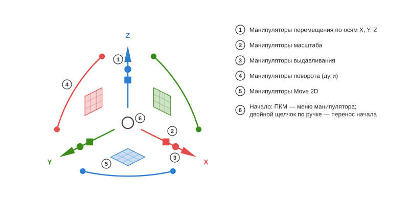

# Axel

*[English](README.md) · Русский*

Манипулятор объектов для 3D-вида FreeCAD по образцу Gumball из Rhinoceros. Python-пакет `freecad.axel`.

## Использование

### Ручки

Выделите объект — манипулятор появится в центре его габаритов. **Стрелки** переносят вдоль оси, **квадрат** — в плоскости, **дуги** поворачивают; штриховая направляющая и подпись у курсора показывают текущее расстояние или угол. Маленький **кубик** на стрелке масштабирует по этой оси, **шарик** выдавливает — здесь замкнутая линия Draft с гранью становится телом `Part::Extrusion`. Кубики и шарики появляются у объектов, для которых верстак объявил адаптер с такими возможностями (линии и вершины Draft, пример `examples/cylinder.py`). **Shift** уточняет: равномерный масштаб на кубике, масштаб в плоскости на квадрате, выдавливание в обе стороны на шарике. Каждое перетаскивание — одна запись отмены.

### Линии Draft: вершины и выдавливание

У выделенной линии Draft на вершинах видны **маркеры**. Щёлкните маркер — манипулятор перейдёт в вершину, и стрелки будут двигать только её. У концевой вершины открытой линии шарик выдавливания вытягивает **новый сегмент** — потяните ещё раз, и линия продолжится. Щелчок по самой линии возвращает манипулятор к объекту целиком; кубик масштаба тогда преобразует все точки точно, не трогая `Placement`.

### Меню манипулятора

**ПКМ по началу** открывает меню: перенести или сбросить рамку (перенос начала запускает и **двойной щелчок** по любой ручке), выбрать **выравнивание**, взвести **операцию**, задать **силу перетаскивания**, спрятать или показать группы **ручек**. Переключатель **«Шаг»** округляет переносы, повороты и масштаб до заданных приращений — подпись показывает «10,00 mm · step»; **Ctrl** во время перетаскивания временно инвертирует переключатель.

### Выравнивание

Рамка может следовать осям **мира**, собственным осям **объекта** (`Placement` или подсказка адаптера — у линии Draft X идёт вдоль первого сегмента), **рабочей плоскости** Draft или **виду** (X и Y в плоскости экрана). Ручки те же — направления другие; режим запоминается в настройках, его можно и перебирать командой «Axel: следующее выравнивание».

### Двойные буквы: копия, разбивка, выдавливание

Нажмите букву дважды **до** перетаскивания — операция взводится на следующее перетаскивание, подсказка появляется у курсора. `C, C` — перетаскивание делает **копию** и выделяет её, так что серия — это снова `C, C`. `D, D` на линии Draft превращает перетаскивание в **ползунок** числа сегментов (маркеры показывают будущие вершины, цифра задаёт точное число). `E, E` при выбранной концевой вершине **выдавливает** из неё новый сегмент. Адаптеры верстаков могут объявлять свои буквы.

### Числовой ввод

**Щёлкните** стрелку, дугу или кубик масштаба вместо перетаскивания — появится поле ввода: `25` ⏎ переносит на 25 мм, `45` ⏎ поворачивает на 45°, `1,5` ⏎ масштабирует в полтора раза. **Во время перетаскивания** просто начните набирать: цифра открывает поле вдоль текущего направления, а поле понимает единицы и выражения — `3 cm` даёт ровно 30 мм.

Авторам верстаков: [docs/Руководство автора адаптера.md](docs/Руководство%20автора%20адаптера.md), API — `freecad.axel.api` (`API_VERSION = 1`).

## Требования

- FreeCAD ≥ 1.1 (Python 3.11, pivy, PySide из поставки FreeCAD). Внешних зависимостей нет.

## Установка

**Менеджер дополнений** («Инструменты → Менеджер дополнений», тип «прочее»). Пока Axel не попал в каталог FreeCAD, добавьте репозиторий вручную: в настройках Менеджера дополнений («Пользовательские репозитории») укажите адрес `https://github.com/Onyx125/Axel` и ветку `main`, затем найдите «Axel» в списке и нажмите «Установить». Axel — не верстак, поэтому Менеджер дополнений **не напомнит о перезапуске**: после установки или обновления перезапустите FreeCAD вручную.

**Вручную:** скопируйте папку репозитория (или распакуйте архив выпуска) в `Mod/Axel` пользовательской папки FreeCAD — на Windows `%APPDATA%\FreeCAD\v1-1\Mod\Axel`, — чтобы внутри лежали `package.xml` и `freecad/axel/`. Перезапустите FreeCAD.

После запуска у выделенного объекта появляется манипулятор; включить и выключить его можно кнопкой «Axel» в строке состояния или командой в меню «Вид».

## Лицензия

LGPL-2.1-or-later, как у FreeCAD.
