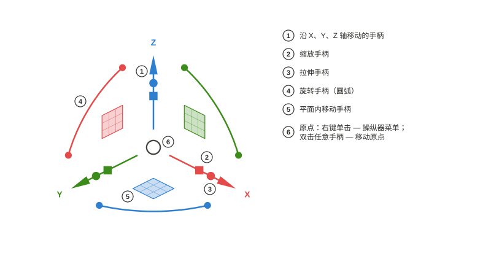
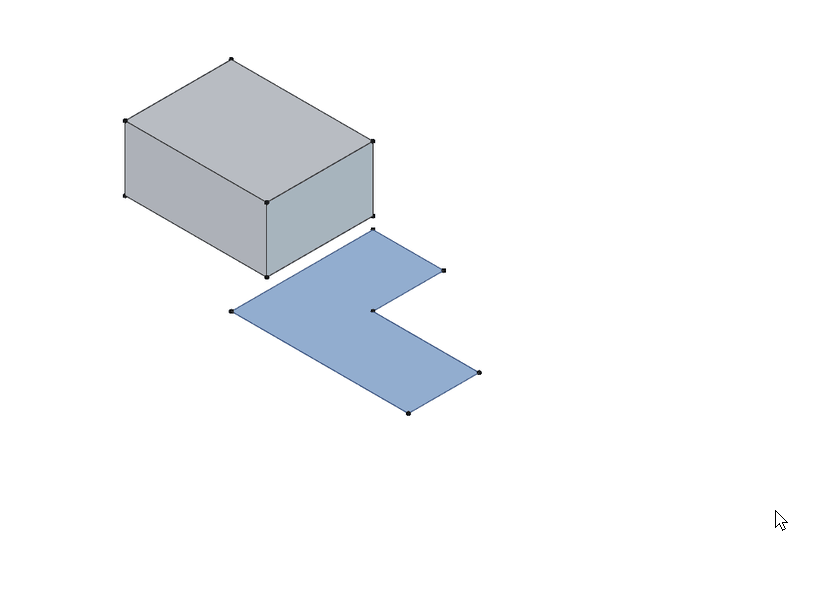
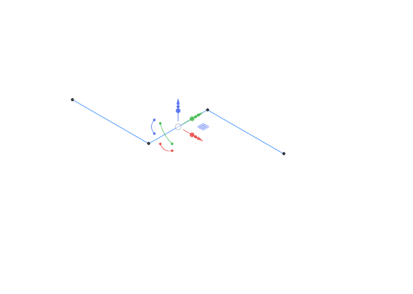
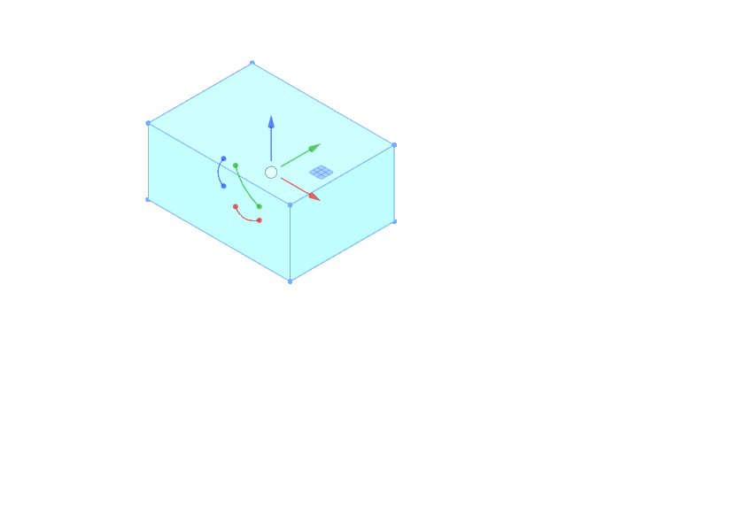
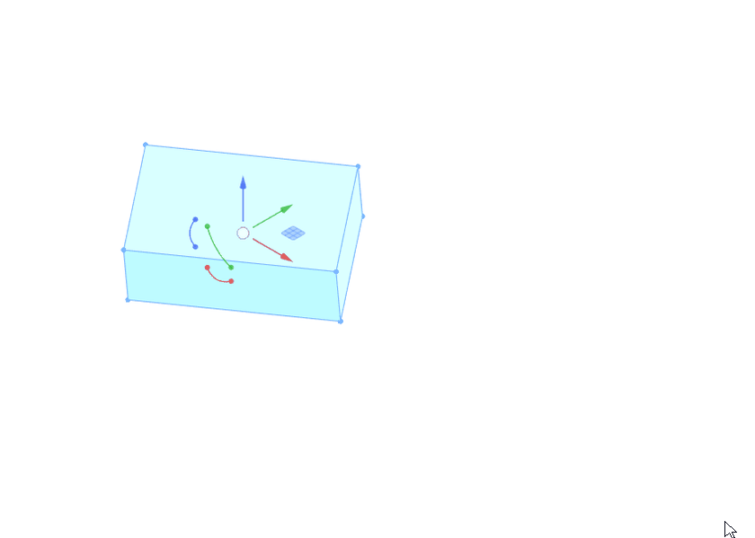
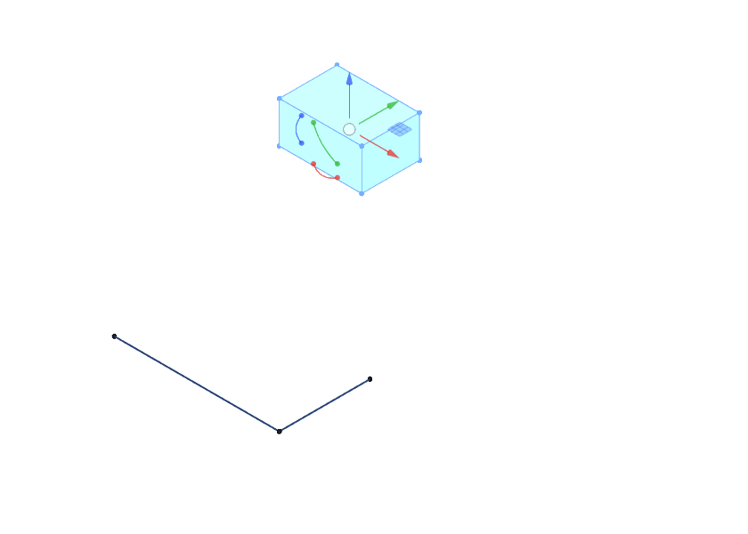
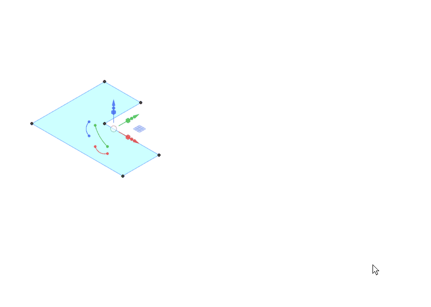

# Axel

*[English](README.md) · [Русский](README.ru.md) · [Deutsch](README.de.md) · [Français](README.fr.md) · [Español](README.es.md) · [Português (Brasil)](README.pt-BR.md) · 简体中文 · [日本語](README.ja.md)*

FreeCAD 3D 视图的对象操纵器，仿照 Rhinoceros 的 Gumball 设计。Python 包 `freecad.axel`。

## 使用

### 手柄

选中一个对象，操纵器就会出现在其包围盒的中心。**箭头**沿轴移动，**方块**在平面内移动，**圆弧**旋转；虚线导引线和光标旁的标签显示当前的距离或角度。箭头上的小**立方体**沿该轴缩放；**圆点**用于拉伸——这里一条带面的闭合 Draft 线变成了 `Part::Extrusion` 实体。立方体和圆点只出现在其工作台声明了具备这些能力的适配器的对象上（Draft 线和顶点、示例 `examples/cylinder.py`）。**Shift** 用于细化：在立方体上等比缩放，在方块上平面内缩放，在圆点上向两侧拉伸。每次拖动都是一个撤销步骤。

### Draft 线：顶点与拉伸

选中的 Draft 线会在顶点处显示**标记**。单击一个标记，操纵器跳到该顶点：此时箭头只移动这一个点。在开放线的末端顶点上，拉伸圆点会拉出一个**新线段**——再拖一次即可继续延伸这条线。单击线本身，操纵器回到整个对象；此时缩放立方体会精确变换所有点，而不改动 `Placement`。

### 操纵器菜单

**在原点上右键单击**打开菜单：移动或重置坐标架（在任意手柄上**双击**同样会开始移动原点）、选择**对齐方式**、预备一项**操作**、设置**拖动力度**、隐藏或显示各组**手柄**。**步长**开关使移动、旋转和缩放按设定的增量吸附——标签显示为“10.00 mm · 步长”；拖动时按住 **Ctrl** 可临时反转该开关。

### 对齐

坐标架可以跟随**世界**坐标轴、**对象**自身的坐标轴（`Placement`，或来自适配器的提示——对 Draft 线而言，X 沿其第一段）、Draft 的**工作平面**，或**视图**（X 和 Y 位于屏幕平面内）。手柄相同，方向不同；模式保存在设置中，也可以用 *Axel：下一个对齐方式* 命令循环切换。

### 双击字母：复制、拆分、拉伸

在拖动**之前**连按两次同一字母，即为下一次拖动预备一项操作；提示出现在光标旁。`C, C`——拖动会创建一个**副本**并选中它，因此连续复制只需再按 `C, C`。在 Draft 线上按 `D, D`，拖动变成线段数量的**滑块**（标记预览新的顶点；输入数字可设定精确数量）。选中末端顶点后按 `E, E`，从该顶点**拉伸**出一个新线段。工作台适配器可以声明自己的字母。

### 数值输入

**单击**箭头、圆弧或缩放立方体（而不是拖动它），会出现一个输入框：`25` ⏎ 移动 25 mm，`45` ⏎ 旋转 45°，`1.5` ⏎ 缩放 1.5 倍。**拖动过程中**直接开始键入即可：数字会沿当前方向打开输入框，输入框支持单位和表达式——`3 cm` 恰好得到 30 mm。

工作台作者请参阅 [docs/Adapter Author Guide.md](docs/Adapter%20Author%20Guide.md)（英文）；API 为 `freecad.axel.api`（`API_VERSION = 1`）。

## 要求

- FreeCAD ≥ 1.1（Python 3.11、pivy 和 PySide 均随 FreeCAD 提供）。无外部依赖。

## 安装

**插件管理器**（工具 → *Addon Manager*——FreeCAD 1.1 中该菜单项仍为英文，内容类型“Other”）。在 Axel 收录进 FreeCAD 目录之前，请手动添加仓库：在插件管理器的首选项（“自定义仓库”）中输入 `https://github.com/Onyx125/Axel`，分支为 `main`，然后在列表中找到“Axel”并点击安装。Axel 不是工作台，因此插件管理器**不会提醒您重启**：安装或更新后请手动重启 FreeCAD。

**手动安装：**将仓库文件夹（或解压后的发布归档）复制到 FreeCAD 用户目录下的 `Mod/Axel`——Windows 上为 `%APPDATA%\FreeCAD\v1-1\Mod\Axel`——使 `package.xml` 和 `freecad/axel/` 位于其中。重启 FreeCAD。

启动后，操纵器会出现在选中的对象上；状态栏中的“Axel”按钮或“视图”菜单中的命令可以打开和关闭它。

## 许可证

LGPL-2.1-or-later，与 FreeCAD 相同。
